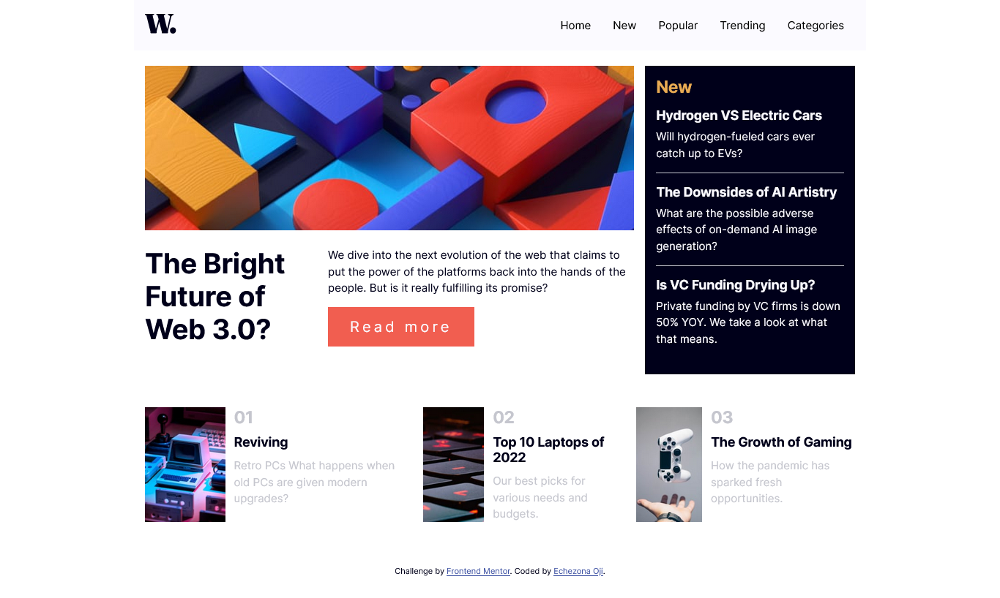
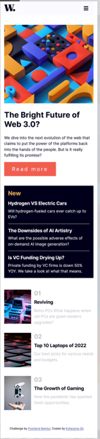

# Frontend Mentor - News homepage solution

This is a solution to the [News homepage challenge on Frontend Mentor](https://www.frontendmentor.io/challenges/news-homepage-H6SWTa1MFl). Frontend Mentor challenges help you improve your coding skills by building realistic projects.

## Table of contents

- [Overview](#overview)
  - [The challenge](#the-challenge)
  - [Screenshot](#screenshot)
  - [Links](#links)
- [My process](#my-process)
  - [Built with](#built-with)
  - [What I learned](#what-i-learned)
  - [Continued development](#continued-development)
  - [Useful resources](#useful-resources)
- [Author](#author)
- [Acknowledgments](#acknowledgments)

## Overview

### The challenge

Users should be able to:

- View the optimal layout for the interface depending on their device's screen size
- See hover and focus states for all interactive elements on the page
- **Bonus**: Toggle the mobile menu (requires some JavaScript)

### Screenshots




### Links

- [Solution URL](https://github.com/zonafrank/frontendmentor-news-homepage)
- [Live Site URL](https://zonafrank.github.io/frontendmentor-news-homepage/)

## My process

I used html, plain css and plain javascript for this project.

The steps I followed are as follows:

1. Using the html to structure the page
1. Writing the javascript code required to show and hide the nav bar in mobile mode.
1. Using CSS to style the page to look as close to the provided image as possible.

### Built with

- Semantic HTML5 markup
- CSS custom properties
- Flexbox
- Mobile-first workflow

### What I learned

The challenge gave me some more practice in positioning page components, which is an area I still find a bit challenging.
I was also able to get some more practice in using CSS custom components.

To see how you can add code snippets, see below:

```css
:root {
  --soft-red: hsl(5, 85%, 63%);
  --soft-orange: hsl(35, 77%, 62%);
  --off-white: hsl(252, 100%, 99%);
  --grayfish-blue: hsl(233, 8%, 79%);
  --dark-grayfish-blue: hsl(236, 13%, 42%);
  --very-dark-blue: hsl(240, 100%, 5%);
  font-size: 15px;
}

nav {
  padding: 0 15px;
  position: fixed;
  top: 0;
  left: 0;
  right: 0;
  background-color: var(--off-white);
}
```

```js
const proudOfThisFunc = () => {
  console.log("🎉");
};
```

### Continued development

I will proceed to attempt other challenges, so that I can improve my skill in building page layouts from other mockups.

### Useful resources

- [Mozilla](https://developer.mozilla.org/en-US/docs/Web/CSS) - Was useful in many instances where I needed to make things sit properly, especially in making the images fit into their parent containers.

## Author

- Frontend Mentor - [@zonafrank](https://www.frontendmentor.io/profile/zonafrank)
